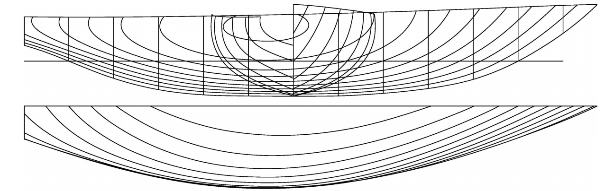

# Comparison of regression models for predicting boat residuary resistance based on existing model basin data

## Softuni.bg Machine Learning Feb 2018 course project

## Ognian Dantchev

# Introduction

Prediction of residuary resistance of sailing yachts at the initial design stage is of a great value for evaluating the ship's performance and for estimating the required propulsive power. Essential inputs include the basic hull dimensions and the boat velocity. 

The Delft data set comprises 308 full-scale experiments, which were performed at the Delft Ship Hydromechanics Laboratory of the Delft University of Technology. 
These experiments include 22 different hull forms, derived from a parent form closely related to the Standfast 43 boat, [http://sailboatdata.com/viewrecord.asp?class_id=4810]

The source of the __Yacht Hydrodynamics Data Set__, [\[0\]](#references), is the UCI Machine Learning Repository.  

Fig. 1:  Linesplan Sysser 1, base model for series 1 of Delft Systematic Yacht Hull Series

Attribute Information:

Variations concern hull geometry coefficients and the Froude number: 

1. Longitudinal position of the center of buoyancy, adimensional; 
2. Prismatic coefficient $C_P$, adimensional;
3. Length-displacement ratio, adimensional;
4. Beam-draught ratio, adimensional; 
5. Length-beam ratio, adimensional;
6. Froude number $Fr$, [1], adimensional;
7. Residuary resistance $C_R$, [2], per unit weight of displacement, adimensional. (The measured variable and target  we'll try to predict using regression models)

The measurement data in the set is from model tests of the Delft Systematic Yacht Hull Series (DSYHS). This series has been started in 1973 by professor J. Gerritsma of TU Delft, in cooperation with N. Newman and J. Kerwin of the Massachusetts Institute of Technology (MIT). 
